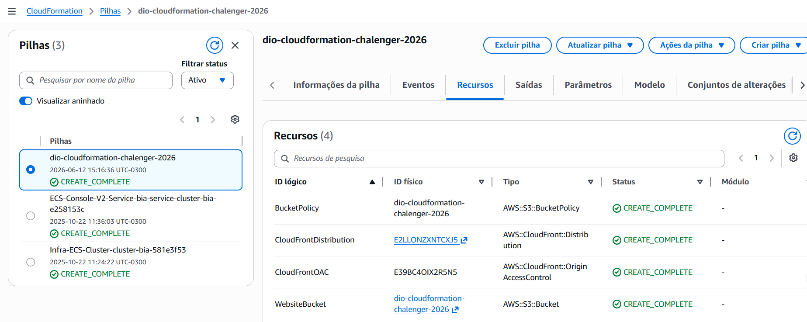
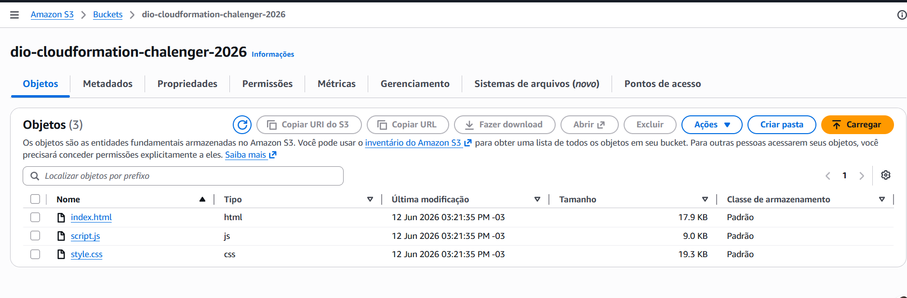
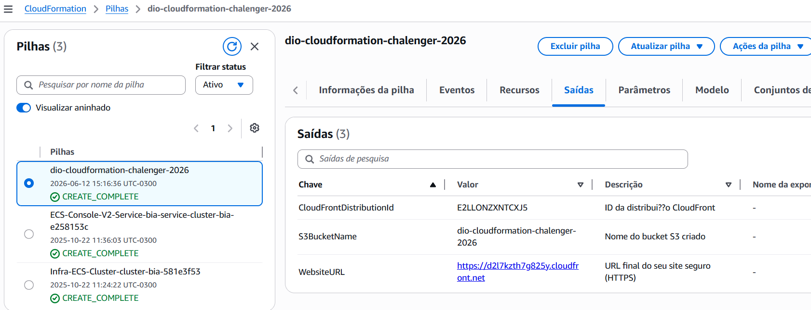

# 🌐 Site Estático Seguro e Global com AWS CloudFormation

Um projeto de desafio do Bootcamp DIO GFT que demonstra como criar e implantar um **website estático seguro, escalável e com distribuição global** usando **AWS CloudFormation**, **Amazon S3**, **CloudFront** e **HTTPS gratuito**.

## 📋 Sobre o Projeto

Este é um template CloudFormation que automatiza a criação de uma arquitetura serverless completa para hospedar sites estáticos na nuvem. A solução utiliza as melhores práticas de segurança e desempenho da AWS, garantindo que seu conteúdo seja entregue de forma rápida e segura para usuários em qualquer lugar do mundo.

### Principais Características

- **🔒 Segurança de Ponta**: O bucket S3 é completamente privado com bloqueio de acesso público
- **🚀 Performance Global**: CloudFront (CDN) distribui seu conteúdo em múltiplas regiões
- **🔐 HTTPS Gratuito**: Certificado SSL/TLS padrão do CloudFront (.cloudfront.net)
- **⚡ Otimização Automática**: Compressão Gzip/Brotli para reduzir tamanho de transferência
- **🎯 Cache Inteligente**: Estratégia de cacheamento para melhor performance
- **🛡️ Controle de Acesso Seguro**: Uso de Origin Access Control (OAC) para acesso seguro entre serviços

---

## 📂 Estrutura do Repositório

```
.
├── README.md                          # Este arquivo
├── template.yaml                      # Template CloudFormation (IaC)
├── Site/                              # Website estático
│   ├── index.html                     # Página principal
│   ├── style.css                      # Estilos do site
│   └── script.js                      # Interatividade
└── Imagens/                           # Screenshots da arquitetura (opcional)
```

---

## 🏗️ Arquitetura

```
┌─────────────────┐
│   Seu Website   │
│  (index.html)   │
└────────┬────────┘
         │ Upload
         ▼
┌─────────────────────────────────┐
│    Amazon S3 (Privado)          │
│  - Sem acesso público direto    │
│  - Bloqueio de ACLs públicas    │
│  - Bloqueia políticas públicas  │
└────────┬────────────────────────┘
         │ Acesso via OAC
         ▼
┌─────────────────────────────────┐
│     CloudFront (CDN)            │
│  - HTTPS gratuito               │
│  - Distribuição global          │
│  - Cache de conteúdo            │
│  - Compressão de dados          │
└────────┬────────────────────────┘
         │
         ▼
┌─────────────────────────────────┐
│    Usuários em todo Mundo       │
│  https://xxx.cloudfront.net     │
└─────────────────────────────────┘
```

---

## 📦 Componentes Criados

### 1. **Amazon S3 Bucket** 🪣
- Armazena todos os arquivos do seu website estático
- Configurado como privado com bloqueio total de acesso público
- Nome: `dio-cloudformation-chalenger-2026`

### 2. **CloudFront Distribution** 📡
- CDN (Content Delivery Network) que distribui seu conteúdo globalmente
- Fornece HTTPS gratuito com certificado SSL/TLS padrão
- Força redirecionamento de HTTP para HTTPS (maior segurança)
- Habilita compressão de dados (Gzip/Brotli)

### 3. **Origin Access Control (OAC)** 🔑
- Mecanismo de segurança que permite APENAS o CloudFront acessar o S3
- Usa assinatura AWS SigV4 para autenticação
- Previne acesso direto ao bucket S3

### 4. **Bucket Policy** 🛡️
- Política de segurança que autoriza apenas a distribuição CloudFront específica
- Bloqueia qualquer outro acesso ao conteúdo do bucket

---

## ⚙️ Pré-requisitos

Para implantar este projeto, você precisará de:

- Uma **conta AWS ativa** com permissões administrativas
- **AWS CLI** instalado e configurado (`aws configure`)
- Arquivos do seu website (pelo menos `index.html`)
- Conhecimento básico de CloudFormation (opcional)

---

## 🚀 Como Fazer Deploy

### **Opção 1: Usando AWS CLI (Recomendado)**

```bash
# 1. Clone ou baixe este repositório
git clone https://github.com/hugokokay/Dio_CloudeFormation_Chalenger.git
cd Dio_CloudeFormation_Chalenger

# 2. Crie a stack CloudFormation
aws cloudformation create-stack \
  --stack-name site-estatico-seguro \
  --template-body file://template.yaml

# 3. Aguarde a criação (pode levar alguns minutos)
aws cloudformation wait stack-create-complete \
  --stack-name site-estatico-seguro

# 4. Faça upload do website
BUCKET_NAME="dio-cloudformation-chalenger-2026"
aws s3 sync ./Site s3://$BUCKET_NAME/ --delete

# 5. Obtenha a URL do seu site
aws cloudformation describe-stacks \
  --stack-name site-estatico-seguro \
  --query 'Stacks[0].Outputs[?OutputKey==`WebsiteURL`]'
```
```

### **Opção 2: Usando AWS Console**

1. Acesse o [AWS CloudFormation Console](https://console.aws.amazon.com/cloudformation/)
2. Clique em **"Create Stack"**
3. Selecione **"Upload a template file"** e escolha `template.yaml`
4. Clique em **"Next"** e complete os passos
5. Revise e clique em **"Create Stack"**
6. Após a criação, use o AWS CLI ou S3 Console para fazer upload dos arquivos da pasta `Site/`

---

## 📤 Como Fazer Upload do Seu Website

Após o CloudFormation ter criado os recursos:

```bash
# 1. Obtenha o nome do bucket
BUCKET_NAME="dio-cloudformation-chalenger-2026"

# 2. Opção A: Upload dos arquivos da pasta Site
aws s3 sync ./Site s3://$BUCKET_NAME/ --delete

# 2. Opção B: Upload individual
aws s3 cp Site/index.html s3://$BUCKET_NAME/
aws s3 cp Site/style.css s3://$BUCKET_NAME/
aws s3 cp Site/script.js s3://$BUCKET_NAME/

# 3. Verifique se os arquivos foram enviados
aws s3 ls s3://$BUCKET_NAME/
```

**Dica:** Os arquivos da pasta `Site/` já contêm um website moderno e responsivo pronto para usar!

---

## 🔍 Verificando a Implantação

```bash
# 1. Obtenha a URL do seu site
aws cloudformation describe-stacks \
  --stack-name site-estatico-seguro \
  --query 'Stacks[0].Outputs'

# 2. A saída incluirá:
# - WebsiteURL: URL final do seu site (ex: https://xxx.cloudfront.net)
# - S3BucketName: Nome do bucket S3
# - CloudFrontDistributionId: ID da distribuição
```

Abra a URL no seu navegador e veja seu site funcionando! 🎉

---

## 📊 Parâmetros do Template

| Parâmetro | Padrão | Descrição |
|-----------|--------|-----------|
| `IndexDocument` | `index.html` | Nome do arquivo principal do site |

Você pode alterar este parâmetro durante o deploy se seu arquivo principal tiver outro nome.

---

## 🔐 Segurança

Este projeto implementa várias camadas de segurança:

✅ **Bucket S3 Privado**: Nenhum acesso público direto
✅ **Origin Access Control**: Apenas CloudFront acessa o S3
✅ **HTTPS Obrigatório**: Todo tráfego HTTP é redirecionado para HTTPS
✅ **Política de Mínimo Privilégio**: Permissões restritas apenas ao necessário
✅ **Bloqueio de ACLs Públicas**: Impede configurações perigosas
✅ **TLS 1.2+**: Protocolo de segurança moderno

---

## 💰 Custos Estimados

Este projeto é muito econômico:

- **CloudFront**: ~$0.085 por GB transferido (primeiros 10TB/mês)
- **S3**: ~$0.023 por GB armazenado
- **Data Transfer Out**: Incluído na taxa do CloudFront
- **HTTPS**: Gratuito (certificado padrão)

*Exemplo: Um site de 10 MB com 10 GB de transferência por mês custaria menos de $1*

---

## 📚 Recursos Adicionais

- [Documentação AWS CloudFormation](https://docs.aws.amazon.com/cloudformation/)
- [Documentação Amazon S3](https://docs.aws.amazon.com/s3/)
- [Documentação Amazon CloudFront](https://docs.aws.amazon.com/cloudfront/)
- [AWS CLI Reference](https://docs.aws.amazon.com/cli/)

---

## � Screenshots da Implementação

### CloudFormation - Criação da Stack


*Tela de criação da stack no AWS CloudFormation Console*

---

### Amazon S3 - Bucket com Arquivos


*Bucket S3 contendo os arquivos do website (index.html, style.css, script.js)*

---

### CloudFront - Distribuição Ativa


*Distribuição CloudFront ativa servindo o conteúdo do S3 via HTTPS*

---

## �🗑️ Limpeza (Remover Recursos)

Para evitar custos desnecessários, você pode deletar a stack:

```bash
aws cloudformation delete-stack --stack-name site-estatico-seguro
```

⚠️ **Aviso**: Isso removerá TODOS os recursos criados (S3, CloudFront, etc.)

---

## 📝 Website Incluído

Este projeto já vem com um **website moderno e responsivo** na pasta `Site/`, incluindo:

- 📄 **index.html** - Página responsiva com todas as informações do projeto
- 🎨 **style.css** - Design moderno com gradientes, animações e totalmente responsivo
- ⚡ **script.js** - Interatividade com validação de formulário, menu mobile e animações ao scroll

### ✨ Características do Website Incluído:

- Seções: Home, Sobre, Arquitetura, Componentes, Deploy, Segurança, Custos, Pré-requisitos
- Totalmente responsivo (mobile, tablet, desktop)
- Design moderno com cores AWS (laranja + azul)
- Animações suaves e efeitos interativos
- Menu mobile responsivo
- Diagrama visual da arquitetura
- Links para o repositório GitHub

**Basta fazer o upload desses arquivos no S3 para ter seu website em produção!**

### 📝 Se Preferir Criar Seu Próprio Website Mínimo:

```html
<!DOCTYPE html>
<html lang="pt-BR">
<head>
    <meta charset="UTF-8">
    <meta name="viewport" content="width=device-width, initial-scale=1.0">
    <title>Meu Site Estático Seguro</title>
    <style>
        body {
            font-family: Arial, sans-serif;
            text-align: center;
            padding: 50px;
            background: #f0f0f0;
        }
        h1 { color: #333; }
    </style>
</head>
<body>
    <h1>🎉 Site Estático com AWS CloudFormation!</h1>
    <p>Este site está sendo servido de forma segura via HTTPS</p>
    <p>Hospedado em: Amazon S3 + CloudFront</p>
</body>
</html>
```

---

## 🤝 Contribuições

Este é um projeto educacional do Bootcamp DIO GFT. Sinta-se livre para fazer fork, melhorar e compartilhar!

---

## 📄 Licença

Este projeto é fornecido como parte do Bootcamp DIO e está disponível para fins educacionais.

---

**Desenvolvido com ❤️ para o Bootcamp DIO GFT**
